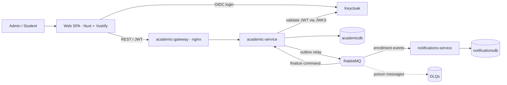

# Academic Enrollment System

**English** · [Português](README.pt-BR.md)

A small but production-shaped academic enrollment system whose real subject is **correctness under concurrency**: many students racing for the last seat in a class, and never one seat too many handed out. Two event-driven Spring Boot services, a Nuxt/Vuetify SPA, RabbitMQ, PostgreSQL, and Keycloak — all reproducible with a single `docker compose up`.

## Built AI-first

This is the project's real differentiator. It wasn't improvised — it was produced with **tanii-os**, a spec-driven, human-approved method whose motto is *AI Accelerated, Human Approved*. Every step ran through a gated artifact chain — **Domain Map → PRD → UI Skeleton → Technical Design → Execution Plan → implementation** — where a human reviewed and approved each artifact before the next began.

Two properties make it stand out:

- **The spec reproduces the build.** At every phase gate the artifacts are reconciled with the shipped code, so they never drift. Another agent could pick up [`tanii/`](tanii/) alone and rebuild the same system.
- **Decisions are traceable, not vibes.** Architecture, security, and data-model choices were surfaced for explicit human approval and recorded — from the seat-concurrency strategy to authorizing by fine-grained action rather than coarse role.

The full specification lives in [`tanii/`](tanii/): [domain map](tanii/domain-map.md) · [PRD](tanii/prd.md) · [UI skeleton](tanii/ui-skeleton.md) · [technical design](tanii/technical-design.md) · [execution plan](tanii/execution-plan.md).

---

## What it does

- **Admins** manage the catalog (courses, subjects, classes) and student records, open/close classes, enroll or cancel on behalf of students, and consult enrollments.
- **Students** browse open classes, build a cart, check out, and watch each enrollment resolve to **CONFIRMED** or **REJECTED** — the outcome of the seat race.

The interesting part is what happens when two students confirm the **last** seat at the same time: exactly one wins.

## Architecture



- **academic-service** — the core: catalog, enrollment, seat concurrency, outbox.
- **notifications-service** — listens to enrollment events; notifies and writes an append-only audit trail.
- **academic-gateway** — a minimal nginx reverse proxy giving the browser one stable API URL while `academic-service` scales behind it.
- The two services share nothing but **asynchronous events over RabbitMQ**; each owns its own database.

## Tech stack

| Layer | Choice |
| --- | --- |
| Backend | Java 21, Spring Boot 3.3 (Web, Data JPA, Security resource server, AMQP, Actuator, Validation), Flyway |
| Frontend | Nuxt 3 (SPA) + Vuetify 3, Pinia, keycloak-js (OIDC/PKCE) |
| Data | PostgreSQL 16 (two databases, one instance) |
| Messaging | RabbitMQ 3.13 (work queue + fanout, with DLQs) |
| Identity | Keycloak 26 (OIDC, realm imported on startup) |
| Observability | Micrometer Tracing (Brave), Prometheus registry, JSON logs (logstash-logback-encoder) |
| Run & test | Docker Compose; Testcontainers |

---

## Run it

**Prerequisites:** Docker (with Compose). Nothing else — the images build inside Docker.

```bash
docker compose up --build
```

Wait until the app services report healthy, then open **http://localhost:3000**.

| URL | What |
| --- | --- |
| http://localhost:3000 | Web app |
| http://localhost:8081/swagger-ui.html | API docs (OpenAPI) |
| http://localhost:8081/actuator/prometheus | Metrics |
| http://localhost:8080 | Keycloak (console admin: `admin` / `admin`) |
| http://localhost:15672 | RabbitMQ management (`app` / `app`) |

**Seeded logins** (sign in on the app, not the Keycloak console):

| User | Password | Role |
| --- | --- | --- |
| `admin` | `admin123` | Administrator |
| `ana` | `ana123` | Student |

Stop with `docker compose down` (add `-v` to also wipe the database volume).

### See the seat race end to end

Run two API replicas so their finalize consumers compete on the RabbitMQ queue:

```bash
docker compose up --build --scale academic-service=2
```

Create a one-seat open class, enroll two students in it, and confirm both at once — one resolves to **CONFIRMED**, the other to **REJECTED**. (The seeded data includes a two-seat class, `Algorithms 2026.1 - B`, for quick experiments.)

---

## How the seat concurrency works

The seat guarantee is the heart of the system. It combines four techniques:

1. **Accept-then-finalize.** Confirming an enrollment returns **202 Accepted**, moves it to `PROCESSING`, and writes a *finalize command* to a transactional **outbox** — all in one DB transaction. The user gets an instant response; the seat is secured asynchronously.
2. **Optimistic locking + bounded retry.** A finalize consumer reads the `Class` (with its `version`), checks `seats_used < seat_limit`, and increments. A concurrent update bumps the version, so the loser's `UPDATE … WHERE version = n` matches zero rows (`OptimisticLockException`) and retries on a fresh read. When the seats are gone, the enrollment becomes `REJECTED`. **PostgreSQL is the single arbiter** — no distributed lock.
3. **Competing consumers.** Finalize commands go to a RabbitMQ **work queue**; scaling `academic-service` puts multiple consumers on it, which is what makes the race real (a single serial consumer would hide it).
4. **A deterministic test proves it.** `SeatRaceConcurrencyTest` fires N simultaneous confirmations for the last seat and asserts exactly one `CONFIRMED`, the rest `REJECTED` — repeatably.

A seat is held only while an enrollment is `CONFIRMED`; cancelling a confirmed enrollment releases it.

## Messaging & failure handling

- **Transactional outbox + relay.** State changes and their events are written in the same transaction; a relay publishes unpublished rows and marks them sent. At-least-once delivery, never a lost event.
- **Two patterns, one broker.** A **work queue** (`enrollment.finalize.q`) for the finalize command (competing consumers → the race); a **fanout** exchange (`enrollment.events`) broadcasting domain events to notifications and audit queues.
- **Idempotent consumers.** Audit is keyed by a unique `event_id`, so a redelivered message is absorbed, not double-counted.
- **Retry + DLQ.** A message that keeps failing is dead-lettered for inspection instead of looping forever.
- **Additive event versioning** (`enrollment.confirmed.v1`): new optional fields only, never remove or rename.

## Authorization & identity

- **Keycloak owns identity.** Two composite roles (`ADMIN`, `STUDENT`) expand into **fine-grained action rules** (`adm_create_student`, `student_read_enrollment`, …) carried in the token.
- **The backend authorizes on actions, never on the coarse role.** Ownership ("a student acts only on their own enrollments") lives in a small guard that bypasses on the *admin variant of the action* — decoupled and safe (a student token with no linked record can never escalate).
- **Identity linking is just-in-time.** The app never provisions Keycloak users; on a student's first sign-in, `GET /api/students/me` links an existing record by email or materializes one from the token. Admins create the login from the Keycloak console (a per-student shortcut in the UI points there).

## Observability

- **JSON structured logs** with `traceId`/`spanId` on every line.
- **Distributed tracing that crosses the broker.** Because publishing is deferred to the outbox relay (a different thread), the request's trace context is carried in the outbox row and restored at publish time — so a single `traceId` spans HTTP → outbox → relay → broker → consumer. Details in [docs/observability.md](docs/observability.md).
- **Metrics & health** via Actuator + Prometheus (`/actuator/prometheus`, `/actuator/health`).

## Optional dashboards

Two optional stacks ride behind **Docker Compose profiles** — a plain `docker compose up` stays lean and never starts them.

**Observability** — metrics + logs:

```bash
docker compose --profile observability up
```

- **Grafana** → http://localhost:3001 (anonymous admin) — provisioned Prometheus + Loki datasources and an *Academic Enrollment — Overview* dashboard (HTTP request rate, JVM heap, live JSON logs).
- **Prometheus** → http://localhost:9090 — scrapes both services (all replicas via DNS discovery).
- **Loki + Promtail** collect every container's JSON logs, labeled by `service` and `level` (the `traceId` travels in the log body).

**Business metrics** — Metabase:

```bash
docker compose --profile business up
```

- **Metabase** → http://localhost:3002 — **auto-provisioned**: a one-shot init container creates the admin, connects `academicdb`, and builds an *Academic — Business Overview* starter dashboard (enrollments by status, seat fill by class). Sign in with `admin@example.com` / `metabase123`; add your own questions from there.

Start everything together with `docker compose --profile observability --profile business up`.

## Testing

Each service is tested with JUnit + Testcontainers (real PostgreSQL and RabbitMQ in Docker):

```bash
cd services/academic-service && mvn test
cd services/notifications-service && mvn test
```

Coverage spans domain rules, REST flows, event publish/consume, DLQ behavior, authorization, and the last-seat concurrency race.

## Project structure

```
academic-enrollment-system/
├── services/
│   ├── academic-service/         catalog · enrollment · seat concurrency · outbox
│   └── notifications-service/    events → notify + audit trail
├── web/                          Nuxt/Vuetify SPA
├── infra/                        postgres init · keycloak realm · nginx gateway
├── docs/                         observability.md
├── docker-compose.yml            full local stack
└── tanii/                        the method artifacts that specify this build
```

## License

See [LICENSE](LICENSE).
