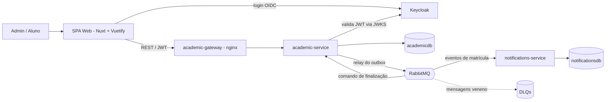

# Sistema de Matrícula Acadêmica

[English](README.md) · **Português**

Um sistema de matrícula acadêmica pequeno, mas com forma de produção, cujo tema real é **correção sob concorrência**: vários alunos disputando a última vaga de uma turma, sem nunca entregar uma vaga a mais. Dois serviços Spring Boot orientados a eventos, uma SPA Nuxt/Vuetify, RabbitMQ, PostgreSQL e Keycloak — tudo reproduzível com um único `docker compose up`.

## Construído IA-first

Este é o verdadeiro diferencial do projeto. Ele não foi improvisado — foi produzido com o **tanii-os**, um método guiado por especificação e aprovado por humano, cujo lema é *AI Accelerated, Human Approved*. Cada passo passou por uma cadeia de artefatos com gate — **Domain Map → PRD → UI Skeleton → Technical Design → Execution Plan → implementação** — em que um humano revisou e aprovou cada artefato antes do próximo começar.

Duas propriedades o destacam:

- **A especificação reproduz o build.** A cada gate de fase os artefatos são reconciliados com o código entregue, então nunca divergem. Outra IA poderia pegar só o [`tanii/`](tanii/) e reconstruir o mesmo sistema.
- **Decisões são rastreáveis, não "vibe".** Escolhas de arquitetura, segurança e modelo de dados foram levadas a aprovação humana explícita e registradas — da estratégia de concorrência de vaga a autorizar por regra fina de ação em vez de papel coarse.

A especificação completa vive em [`tanii/`](tanii/): [domain map](tanii/domain-map.md) · [PRD](tanii/prd.md) · [UI skeleton](tanii/ui-skeleton.md) · [technical design](tanii/technical-design.md) · [execution plan](tanii/execution-plan.md).

---

## O que faz

- **Administradores** gerenciam o catálogo (cursos, matérias, turmas) e os registros de alunos, abrem/fecham turmas, matriculam ou cancelam em nome de alunos, e consultam matrículas.
- **Alunos** navegam pelas turmas abertas, montam um carrinho, finalizam, e acompanham cada matrícula resolver para **CONFIRMED** ou **REJECTED** — o desfecho da disputa por vaga.

A parte interessante é o que acontece quando dois alunos confirmam a **última** vaga ao mesmo tempo: exatamente um vence.

## Arquitetura



- **academic-service** — o núcleo: catálogo, matrícula, concorrência de vaga, outbox.
- **notifications-service** — ouve os eventos de matrícula; notifica e grava uma trilha de auditoria append-only.
- **academic-gateway** — um proxy reverso nginx mínimo que dá ao navegador uma URL de API estável enquanto o `academic-service` escala por trás.
- Os dois serviços não compartilham nada além de **eventos assíncronos via RabbitMQ**; cada um é dono do próprio banco.

## Stack

| Camada | Escolha |
| --- | --- |
| Backend | Java 21, Spring Boot 3.3 (Web, Data JPA, Security resource server, AMQP, Actuator, Validation), Flyway |
| Frontend | Nuxt 3 (SPA) + Vuetify 3, Pinia, keycloak-js (OIDC/PKCE) |
| Dados | PostgreSQL 16 (dois bancos, uma instância) |
| Mensageria | RabbitMQ 3.13 (work queue + fanout, com DLQs) |
| Identidade | Keycloak 26 (OIDC, realm importado na subida) |
| Observabilidade | Micrometer Tracing (Brave), registry Prometheus, logs JSON (logstash-logback-encoder) |
| Rodar & testar | Docker Compose; Testcontainers |

---

## Como rodar

**Pré-requisitos:** Docker (com Compose). Nada além disso — as imagens são construídas dentro do Docker.

```bash
docker compose up --build
```

Aguarde os serviços de app ficarem healthy e abra **http://localhost:3000**.

| URL | O quê |
| --- | --- |
| http://localhost:3000 | Aplicação web |
| http://localhost:8081/swagger-ui.html | Documentação da API (OpenAPI) |
| http://localhost:8081/actuator/prometheus | Métricas |
| http://localhost:8080 | Keycloak (admin do console: `admin` / `admin`) |
| http://localhost:15672 | Management do RabbitMQ (`app` / `app`) |

**Usuários seedados** (faça login na aplicação, não no console do Keycloak):

| Usuário | Senha | Papel |
| --- | --- | --- |
| `admin` | `admin123` | Administrador |
| `ana` | `ana123` | Aluno |

Pare com `docker compose down` (adicione `-v` para também apagar o volume do banco).

### Ver a disputa por vaga de ponta a ponta

Suba duas réplicas da API para que os consumidores de finalização compitam na fila do RabbitMQ:

```bash
docker compose up --build --scale academic-service=2
```

Crie uma turma aberta de 1 vaga, inscreva dois alunos nela e confirme ambos ao mesmo tempo — um resolve para **CONFIRMED**, o outro para **REJECTED**. (O seed já inclui uma turma de 2 vagas, `Algorithms 2026.1 - B`, para experimentos rápidos.)

---

## Como funciona a concorrência de vaga

A garantia de vaga é o coração do sistema. Combina quatro técnicas:

1. **Aceitar-então-finalizar.** Confirmar uma matrícula retorna **202 Accepted**, move para `PROCESSING` e grava um *comando de finalização* num **outbox** transacional — tudo numa transação de banco. O usuário tem resposta imediata; a vaga é garantida de forma assíncrona.
2. **Optimistic lock + retry limitado.** Um consumidor de finalização lê a `Class` (com seu `version`), checa `seats_used < seat_limit` e incrementa. Uma alteração concorrente sobe o version, então o `UPDATE … WHERE version = n` do perdedor casa zero linhas (`OptimisticLockException`) e tenta de novo com leitura fresca. Quando não há mais vagas, a matrícula vira `REJECTED`. **O PostgreSQL é o árbitro único** — sem lock distribuído.
3. **Consumidores concorrentes.** Os comandos de finalização vão para uma **work queue** do RabbitMQ; escalar o `academic-service` coloca vários consumidores nela, e é isso que torna a disputa real (um consumidor serial esconderia a corrida).
4. **Um teste determinístico prova.** O `SeatRaceConcurrencyTest` dispara N confirmações simultâneas para a última vaga e verifica exatamente um `CONFIRMED`, o resto `REJECTED` — de forma repetível.

Uma vaga só fica ocupada enquanto a matrícula está `CONFIRMED`; cancelar uma matrícula confirmada libera a vaga.

## Mensageria & tratamento de falhas

- **Outbox transacional + relay.** As mudanças de estado e seus eventos são gravados na mesma transação; um relay publica as linhas não publicadas e as marca como enviadas. Entrega at-least-once, evento nunca perdido.
- **Dois padrões, um broker.** Uma **work queue** (`enrollment.finalize.q`) para o comando de finalização (consumidores concorrentes → a corrida); um exchange **fanout** (`enrollment.events`) transmitindo os eventos de domínio para as filas de notificação e auditoria.
- **Consumidores idempotentes.** A auditoria é chaveada por um `event_id` único, então uma mensagem reentregue é absorvida, não contada em dobro.
- **Retry + DLQ.** Uma mensagem que falha repetidamente é enviada para a dead-letter para inspeção, em vez de repetir para sempre.
- **Versionamento aditivo de eventos** (`enrollment.confirmed.v1`): apenas novos campos opcionais, nunca remover ou renomear.

## Autorização & identidade

- **O Keycloak é dono da identidade.** Dois papéis compostos (`ADMIN`, `STUDENT`) expandem em **regras finas de ação** (`adm_create_student`, `student_read_enrollment`, …) carregadas no token.
- **O backend autoriza por ação, nunca pelo papel coarse.** O ownership ("um aluno age só sobre as próprias matrículas") vive num guard pequeno que faz bypass pela *variante admin da ação* — desacoplado e seguro (um token de aluno sem registro vinculado nunca escala privilégio).
- **O vínculo de identidade é just-in-time.** A app nunca provisiona usuários no Keycloak; no primeiro login do aluno, o `GET /api/students/me` vincula um registro existente por email ou materializa um a partir do token. Admins criam o login pelo console do Keycloak (um atalho por aluno na UI aponta para lá).

## Observabilidade

- **Logs JSON estruturados** com `traceId`/`spanId` em cada linha.
- **Tracing distribuído que cruza o broker.** Como a publicação é adiada para o relay do outbox (outra thread), o contexto de trace da requisição é carregado na linha do outbox e restaurado na publicação — então um único `traceId` percorre HTTP → outbox → relay → broker → consumidor. Detalhes em [docs/observability.md](docs/observability.md).
- **Métricas & health** via Actuator + Prometheus (`/actuator/prometheus`, `/actuator/health`).

## Dashboards opcionais

Dois stacks opcionais ficam atrás de **profiles do Docker Compose** — um `docker compose up` normal segue enxuto e nunca os sobe.

**Observabilidade** — métricas + logs:

```bash
docker compose --profile observability up
```

- **Grafana** → http://localhost:3001 (admin anônimo) — datasources Prometheus + Loki provisionados e um dashboard *Academic Enrollment — Overview* (taxa de requisições HTTP, heap da JVM, logs JSON ao vivo).
- **Prometheus** → http://localhost:9090 — coleta os dois serviços (todas as réplicas via descoberta por DNS).
- **Loki + Promtail** coletam os logs JSON de cada container, rotulados por `service` e `level` (o `traceId` viaja no corpo do log).

**Métricas de negócio** — Metabase:

```bash
docker compose --profile business up
```

- **Metabase** → http://localhost:3002 — **provisionado automaticamente**: um container de inicialização cria o admin, conecta o `academicdb` e monta um dashboard inicial *Academic — Business Overview* (matrículas por status, ocupação de vagas por turma). Entre com `admin@example.com` / `metabase123`; a partir daí crie suas próprias perguntas.

Suba tudo junto com `docker compose --profile observability --profile business up`.

## Testes

Cada serviço é testado com JUnit + Testcontainers (PostgreSQL e RabbitMQ reais em Docker):

```bash
cd services/academic-service && mvn test
cd services/notifications-service && mvn test
```

A cobertura abrange regras de domínio, fluxos REST, publicação/consumo de eventos, comportamento de DLQ, autorização e a disputa de concorrência pela última vaga.

## Estrutura do projeto

```
academic-enrollment-system/
├── services/
│   ├── academic-service/         catálogo · matrícula · concorrência de vaga · outbox
│   └── notifications-service/    eventos → notifica + trilha de auditoria
├── web/                          SPA Nuxt/Vuetify
├── infra/                        init do postgres · realm do keycloak · gateway nginx
├── docs/                         observability.md
├── docker-compose.yml            stack local completa
└── tanii/                        os artefatos de método que especificam este build
```

## Licença

Veja [LICENSE](LICENSE).
