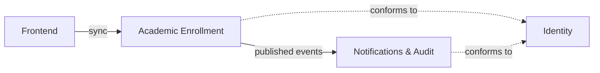

# Domain Map — Academic Enrollment System

## Metadata

- Status: Draft
- Tier: 2

## Subdomains

- **Enrollment** — `Core` — matching students to classes with correct seat rules, consistent under concurrent actions. This is the differentiator and where the hard problem lives.
- **Academic Catalog** — `Supporting` — students, courses, subjects and classes; the structure enrollment operates on.
- **Notifications & Audit** — `Supporting` — reacting to enrollment changes: notifying and keeping an immutable trail.
- **Identity & Access** — `Generic` — authentication and roles; reused, not built.

## Bounded Contexts

| Context | Responsibility | Owns (aggregates) |
|---|---|---|
| **Academic Enrollment** | The catalog and the enrollment lifecycle, including seat integrity under concurrency. | Student, Course, Subject, Class, Enrollment |
| **Notifications & Audit** | React to enrollment events — notify and record an append-only audit trail. | AuditLog (and notification records) |
| **Identity** (external) | Authenticate users and carry their roles. | User, Role |

The Core and Supporting subdomains (Enrollment + Academic Catalog) are realized together in the **Academic Enrollment** context — they share the same consistency boundary (a seat is taken against a class in the same transaction). Notifications & Audit is a separate context precisely so side effects never couple to that boundary.

## Context Map

- **Academic Enrollment → Notifications & Audit** — async, event-driven. *Published language*: Academic Enrollment publishes a stable enrollment event contract; Notifications & Audit is the downstream *customer* and never calls back. Adding a new downstream (e.g. Reporting) does not touch the upstream.
- **Frontend → Academic Enrollment** — synchronous request/response.
- **Academic Enrollment, Notifications & Audit → Identity** — *conformist*: both adopt the external identity provider's token and role model rather than defining their own.

