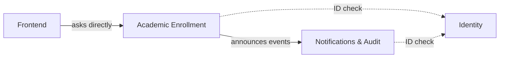

# Domain Map — Academic Enrollment System

Three departments that never open each other's filing cabinets — they talk through agreed channels.

## Metadata

- Status: Approved
- Tier: 2

## Subdomains

- **Enrollment** — `Core` — match students to classes with correct seats, even under simultaneous actions (the hard part).
- **Academic Catalog** — `Supporting` — students, courses, subjects, classes.
- **Notifications & Audit** — `Supporting` — react to enrollment changes: notify and keep a trail.
- **Identity** — `Generic` — who you are and your role (reused, not built).

## Contexts (the departments)

| Context | Owns (aggregates) |
|---|---|
| **Academic Enrollment** | Student, Course, Subject, Class, Enrollment |
| **Notifications & Audit** | AuditLog |
| **Identity** (external) | User, Role |

Enrollment and Catalog share one department — a seat is taken against a class in the same transaction, so they live in one filing cabinet.

## Who talks to whom, and how

- **Frontend → Academic Enrollment** — asks directly (synchronous).
- **Academic Enrollment → Notifications & Audit** — announces enrollment events; the other listens. One-way: a new listener (e.g. Reporting) can be added later without touching the announcer.
- **Everyone → Identity** — just follows the building's ID check.

