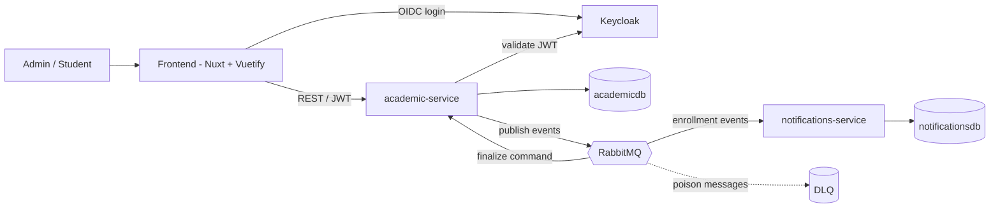
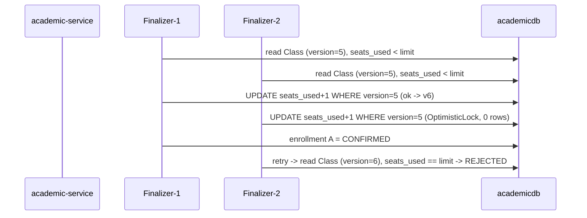

# Technical Design — Academic Enrollment System

## Metadata

- Status: Draft
- Tier: 2
- Mode: AI Architect
- Aggregates: Student, Course, Subject, Class, Enrollment

## Approved Input

- PRD — approved.
- UI Skeleton — approved.

## 1. Scope & Context

Two independent Spring Boot services decoupled by asynchronous events over RabbitMQ, a Nuxt/Vue (Vuetify) frontend, and Keycloak for identity. Business scope lives in the PRD; this document is the "how". Everything runs locally via Docker Compose.

Out of scope (technical): realtime push to the browser (polling instead); multiple database instances (one PostgreSQL, two databases); real cloud deployment.

## 2. Non-Functional Requirements

| Category | Technical stance |
|---|---|
| Concurrency correctness | Optimistic lock on the `Class` seat counter; proven by a concurrency test. |
| Exactly-once outcome | Idempotent consumers keyed by `eventId`; transactional outbox. |
| Resilience of side effects | Notifications/audit failures never block the core; retry + DLQ. |
| Performance at scale | Paged, filtered queries; indexed lookups by student and class. |
| Auditability | Append-only `audit_log` owned by notifications-service. |
| Security | Keycloak OIDC; role-based; ownership checks. |
| Observability | JSON logs + correlation/trace id across HTTP and the broker; health and metrics via Actuator. |

## 3. Dependencies

- Java 21, Spring Boot (Web, Data JPA, Security resource server, AMQP, Actuator, Validation), Flyway, springdoc-openapi, Micrometer/OpenTelemetry.
- PostgreSQL, RabbitMQ, Keycloak.
- Nuxt/Vue + Vuetify.
- Testcontainers; Docker Compose (postgres, rabbitmq, keycloak, academic-service, notifications-service, frontend).

## 4. Backend

### 4.1 Data model

Each service owns its data — no shared tables. One PostgreSQL instance, two databases.

**academic-service (`academicdb`)**

- **Student** — `id` (UUID), `name`, `email` (unique), `document`.
- **Course** — `id`, `name`, `description`.
- **Subject** — `id`, `name`, `course_id` (FK), `description`.
- **Class** — `id`, `subject_id` (FK), `label`, `seat_limit` (int), `seats_used` (int), `status` (`OPEN`|`CLOSED`), `version` (optimistic lock).
- **Enrollment** — `id`, `student_id` (FK), `class_id` (FK), `status` (`PENDING`|`PROCESSING`|`CONFIRMED`|`REJECTED`|`CANCELLED`), `created_at`, `updated_at`. Unique active `(student_id, class_id)` while status is PENDING/PROCESSING/CONFIRMED.
- **outbox** — `id`, `aggregate_type`, `event_type`, `payload` (jsonb), `created_at`, `published_at` (nullable).

**notifications-service (`notificationsdb`)**

- **audit_log** (append-only) — `id`, `event_id` (unique — idempotency), `event_type`, `enrollment_id`, `student_id`, `class_id`, `status`, `occurred_at`, `received_at`, `payload`.

### 4.2 Endpoints

REST/JSON under `/api`, role in parentheses, lists paged/filtered. Full OpenAPI is emitted at build time (mandatory backend output).

- **Catalog (ADMIN):** CRUD `/api/students`, `/api/courses`, `/api/subjects`, `/api/classes`; `POST /api/classes/{id}/open` · `/close`.
- **Browsing (STUDENT/ADMIN):** `GET /api/classes?subjectId=&status=OPEN` (with seat availability).
- **Enrollment:** `POST /api/enrollments` (create PENDING) · `POST /api/enrollments/{id}/confirm` (202, → PROCESSING) · `POST /api/enrollments/{id}/cancel` · `GET /api/enrollments?studentId=&classId=&status=` (ADMIN all; STUDENT own) · `GET /api/enrollments/{id}`.
- **Operational:** `/actuator/health`, `/actuator/prometheus`, `/v3/api-docs` (+ `/swagger-ui`).
- Access management → Keycloak admin console (not a custom API).

### 4.3 Messaging (events & topology)

Broker: **RabbitMQ** (rationale in ADR-0001). Two patterns:

- **Command — work queue:** `enrollment.finalize.q` (+ `.dlq`). academic-service publishes one finalize command per submitted enrollment; concurrent consumers compete — this competition is what creates the seat race.
- **Events — fanout:** exchange `enrollment.events` broadcasts every domain event to two bound queues, `enrollment.notify.q` and `enrollment.audit.q` (+ `.dlq`), both consumed by notifications-service (notify + append to `audit_log`).

Event envelope: `eventId`, `schemaVersion`, `occurredAt` + payload; versioned type names (`enrollment.confirmed.v1`); **additive-only** evolution (new optional fields; never remove/rename); no schema registry. Reliability: transactional outbox, idempotent consumers (by `eventId`), bounded retry + DLQ.

### 4.4 Business rules & concurrency

Lifecycle: `PENDING` (cart) → `PROCESSING` (accepted) → `CONFIRMED` | `REJECTED`; `CANCELLED` from any active state. A seat is consumed only on entering CONFIRMED and released only on CONFIRMED → CANCELLED; PENDING/PROCESSING hold no seat. Create and confirm require an OPEN class; cancel is always allowed.

**Accept-then-finalize:** confirm returns **202 Accepted**, sets the enrollment to PROCESSING and writes a finalize command to the outbox in one transaction; a concurrent finalizer then secures the seat.

**Seat integrity — optimistic locking:** the finalizer reads the `Class` (with `version`), checks `seats_used < seat_limit`, increments, saves. A concurrent change raises `OptimisticLockException` → **bounded retry** (fresh read); if seats are gone → REJECTED. Concurrent consumers are required — a serial consumer would hide the race. Test: N simultaneous confirmations for the last seat → exactly one CONFIRMED, the rest REJECTED.

### 4.5 Authorization & errors

Keycloak OIDC; services are OAuth2 resource servers validating JWTs. Roles: **ADMIN** (catalog, students, access, any enrollment) and **STUDENT** (own enrollments only — ownership check on every student-scoped operation). Standardized error-response envelope; input validation on all writes. Events carry only the identifiers needed — no unnecessary personal data.

## 5. Frontend

Detailed in the approved UI Skeleton — admin management + student self-service, Nuxt/Vue + Vuetify. The asynchronous outcome (CONFIRMED/REJECTED) surfaces on "My Enrollments" via short polling while any enrollment is PROCESSING; no realtime push in scope.

## Architecture Decisions

- **ADR-0001 — RabbitMQ** as broker (not Kafka now; SNS+SQS as the managed equivalent) — see `central/architecture-decisions/0001-messaging-broker-rabbitmq.md`.
- Two independent services integrated only by asynchronous events.
- Optimistic locking (`@Version`) on `Class` + bounded retry for seat integrity.
- Transactional outbox; idempotent consumers; retry + DLQ.
- Per-service databases in one PostgreSQL instance.
- Additive event versioning; no schema registry.
- OpenAPI as a mandatory backend build output.
- Keycloak IdP; roles ADMIN / STUDENT.

## Testing

- Unit: domain rules (seat limit, status transitions, uniqueness, optimistic-retry).
- Integration (Testcontainers: PostgreSQL + RabbitMQ): REST flows, event publish/consume, DLQ.
- Concurrency: the last-seat race test above.

## Risks

- Serial consumer hides the race → configure concurrent listeners and prove with the test.
- Retry storms under heavy contention → bound retries, then REJECTED; keep transactions short.
- Trace propagation across RabbitMQ → verify the correlation id crosses the broker.
