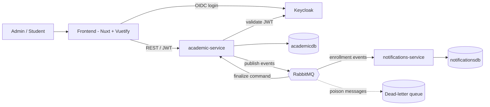
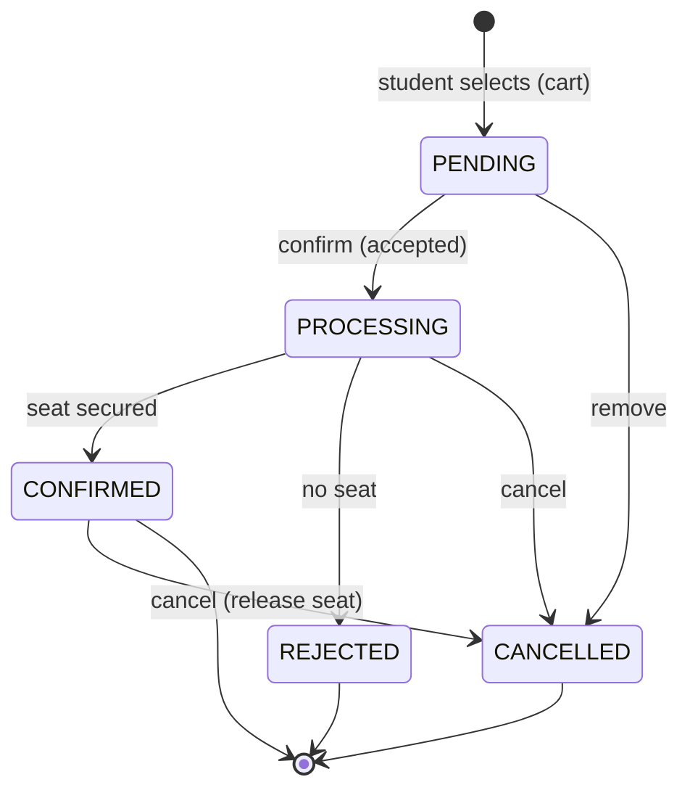
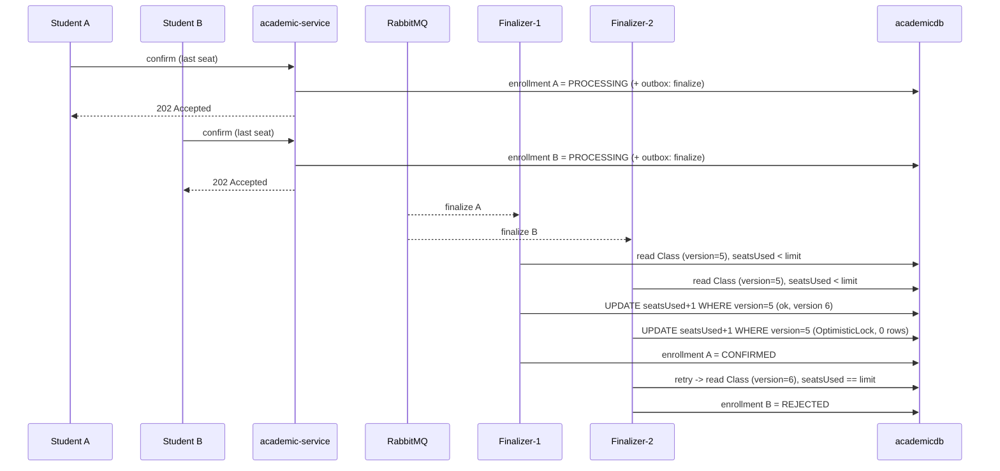
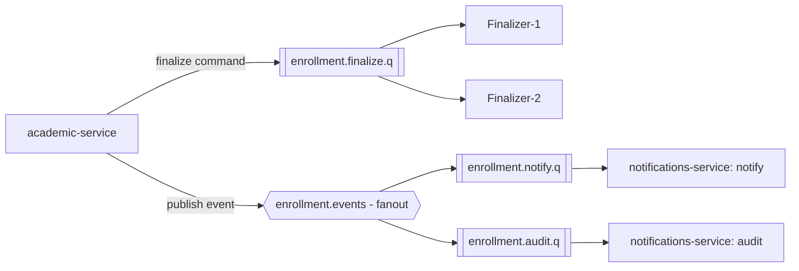

# Technical Design — Academic Enrollment System

## Metadata

- Status: Draft
- Tier: 2
- Mode: AI Architect

## Approved Input

- PRD — approved.
- UI Skeleton — approved.

## System Overview

Two independent Spring Boot services, decoupled by asynchronous domain events over RabbitMQ, a Nuxt/Vue frontend, and Keycloak for identity. Everything runs locally via Docker Compose.

- **academic-service** (Java 21, Spring Boot) — the core domain. Owns Student, Course, Subject, Class, Enrollment. Exposes the REST API, persists to `academicdb` (Flyway migrations), runs the enrollment finalization, and publishes domain events. Layered: `controller` / `application` / `domain` / `repository` / `dto`.
- **notifications-service** (Java 21, Spring Boot) — the separate bounded context. Consumes enrollment events and produces notifications (logged) plus an audit trail in `notificationsdb`. Never called synchronously by the core.
- **frontend** (Nuxt/Vue + Vuetify) — admin and student experiences per the UI Skeleton; authenticates via Keycloak (OIDC); consumes academic-service over REST.
- **Keycloak** — identity provider (OIDC). Services are OAuth2 resource servers validating JWTs; roles `ADMIN` and `STUDENT`.

## Data Ownership

Each service owns its data — no shared tables, which would undermine the context separation. One PostgreSQL instance hosts two independent databases: `academicdb` (academic-service) and `notificationsdb` (notifications-service). Neither service reads the other's database. This keeps real ownership without the operational cost of two database containers.

## API Surface

REST, JSON, under `/api`; authorization by role in parentheses. Lists are paged and filtered. This is the contract-level surface — the full contract is emitted as an OpenAPI document at build time (mandatory backend output).

Catalog (ADMIN):

- `POST/PUT/GET/DELETE /api/students`, `/api/students/{id}`
- `POST/PUT/GET/DELETE /api/courses`, `/api/courses/{id}`
- `POST/PUT/GET/DELETE /api/subjects`, `/api/subjects/{id}` (linked to a course)
- `POST/PUT/GET/DELETE /api/classes`, `/api/classes/{id}`
- `POST /api/classes/{id}/open`, `POST /api/classes/{id}/close`

Browsing (STUDENT / ADMIN):

- `GET /api/classes?subjectId=&status=OPEN` — open classes with seat availability

Enrollment:

- `POST /api/enrollments` — create PENDING (STUDENT for self / ADMIN for any)
- `POST /api/enrollments/{id}/confirm` — returns **202 Accepted**, moves to PROCESSING (owner / ADMIN)
- `POST /api/enrollments/{id}/cancel` — (owner / ADMIN)
- `GET /api/enrollments?studentId=&classId=&status=` — ADMIN all; STUDENT own only
- `GET /api/enrollments/{id}`

Access management → Keycloak admin console (not a custom API).

Operational:

- `GET /actuator/health`, `GET /actuator/prometheus`
- OpenAPI: `GET /v3/api-docs` (+ `/swagger-ui`)

## Enrollment Lifecycle

A seat is consumed only on the transition into CONFIRMED and released only on CONFIRMED → CANCELLED. PENDING and PROCESSING hold no seat.

## Enrollment Finalization (accept-then-finalize)

Checkout is accepted immediately; the seat is secured asynchronously. The diagram shows two students racing for the last seat.

1. Student confirms → academic-service sets the enrollment to **PROCESSING**, returns **202 Accepted**, and writes a `finalize` command to the outbox in the same transaction.
2. The outbox relay publishes to RabbitMQ; a **concurrent finalization consumer** picks it up.
3. It secures a seat with **optimistic locking** → **CONFIRMED**; if no seat, **REJECTED**. The outcome is written to the outbox as `enrollment.confirmed` / `enrollment.rejected`.
4. notifications-service consumes the outcome → notifies + audits.
5. The student sees the outcome on "My Enrollments" (short polling — see below).

## Seat Concurrency — optimistic locking

`Class` carries a `@Version` column and a `seatsUsed` counter against `seatLimit`. The finalization consumer, in one transaction: read the class → check `seatsUsed < seatLimit` → increment → save. If a concurrent transaction changed the version, JPA raises `OptimisticLockException`; the consumer **retries a bounded number of times** (fresh read each attempt). If seats are genuinely gone, the enrollment is **REJECTED**.

**Concurrent consumers are required** so the race is real — a single serial consumer would hide it. The concurrency test asserts: N simultaneous confirmations for the last seat → exactly one CONFIRMED, the rest REJECTED.

## Messaging — broker choice: RabbitMQ

**Decision: RabbitMQ.** Not Kafka, for now. In an AWS-native deployment the equivalent shape would be **SNS + SQS**.

### Business framing

The system coordinates enrollment requests and reacts to them (notify, audit). Volume is **bounded and bursty** (registration windows), not a continuous high-throughput stream. What matters to the business: no request is lost, each is processed exactly once, and failures are visible — not replaying millions of historical events. Choosing the simplest tool that meets these needs keeps the solution cheaper to run, easier to operate, and easier to reason about. Reaching for a heavy streaming platform "just in case" adds cost and operational burden with no return today.

### Technical framing

- The workload is **task/command distribution + pub-sub fan-out**: finalize an enrollment (competing consumers) and broadcast outcome events to notifications/audit. This is exactly RabbitMQ's model — queues with competing consumers, exchanges for fan-out, per-message ack, native retry and dead-lettering.
- **RabbitMQ ≈ SNS + SQS in one broker.** A queue behaves like SQS (competing consumers, ack/visibility, DLQ); an exchange behaves like SNS (fan-out/routing). An AWS-native version of this design maps to **SNS → SQS** with almost no change in shape. We use self-hosted RabbitMQ purely for **local reproducibility** (one Docker Compose, no cloud dependency).
- **Kafka is a different paradigm** — a partitioned, retained commit log for very high throughput, replay, and stream processing. This system needs none of those.
- **Decisive point for correctness:** seat integrity is demonstrated by **concurrent consumers contending at the database**, resolved with optimistic locking. Kafka's idiomatic answer would be to **partition by class id**, which serializes finalizations per class and makes the contention disappear at the partition layer — solving the race by routing rather than by concurrency control. Valid, but it moves the guarantee out of the database and changes what the system demonstrates. RabbitMQ's competing-consumer model keeps the guarantee where the requirement lives: the database.

### When this would change to Kafka

- Sustained high-throughput event streams (orders of magnitude more events per second).
- A need to **replay** the full event history (event sourcing, rebuilding read models, late-joining consumers).
- Many independent consumer groups reading the same immutable stream.
- Stream processing / analytics over the event flow.

Until one of those is real, RabbitMQ is the right-sized choice.

## Messaging Topology

Two distinct patterns, on purpose:

- **Command — work queue (competing consumers).** `enrollment.finalize.q` (direct). academic-service publishes one finalize command per submitted enrollment; its concurrent finalization consumers **compete** for messages — a command is handled by exactly one consumer. This competition is what creates the seat race the database then resolves. Failure path: bounded retry → `enrollment.finalize.dlq`.
- **Events — fanout (broadcast).** Exchange `enrollment.events`. academic-service publishes `enrollment.created / confirmed / rejected / cancelled`. Two independent queues are bound and **each receives a copy of every event**: `enrollment.notify.q` and `enrollment.audit.q`. Failure path: retry → `enrollment.events.dlq`.

The difference in one line: a **command** goes to exactly one consumer (do the work once); an **event** is broadcast to everyone who cares (notify AND audit). That broadcast is fanout.

## Notifications & Audit

notifications-service owns the notifications/audit context and reacts only to events — the core never calls it synchronously.

- **Notifications** (`enrollment.notify.q`) — on confirmed / rejected / cancelled, produce a user-facing notification. In scope these are logged; a real channel (email/in-app) is future evolution.
- **Audit** (`enrollment.audit.q`) — on **every** event, append one immutable row to `audit_log` in `notificationsdb`. The trail answers "what happened to this enrollment, and when"; it is **append-only** — never updated or deleted.

`audit_log` (append-only): `id`, `event_id` (unique — idempotency), `event_type`, `enrollment_id`, `student_id`, `class_id`, `status`, `occurred_at`, `received_at`, `payload`.

- **Idempotent:** the unique `event_id` means a redelivered event produces no duplicate audit row and no duplicate notification.
- **Decoupled & extensible:** the academic core only emits events — it knows nothing about auditing or notifying. Adding a new reactor later (e.g., reporting) is just a new queue bound to `enrollment.events`; the core does not change. That is the payoff of fanout.

## Reliability

- **Transactional Outbox** — events are written to an `outbox` table in the same transaction as the state change; a relay publishes them to RabbitMQ. The event is not lost if the broker is briefly down, and state and events stay consistent.
- **Idempotent consumers** — keyed by `eventId` / enrollment id; a redelivered message never double-consumes a seat or double-notifies.
- **Retry + DLQ** — bounded retries with backoff; poison messages land in a dead-letter queue for inspection.

## Event Schema & Versioning

- Events carry a stable envelope: `eventId`, `schemaVersion`, `occurredAt`, plus the payload (`enrollmentId`, `studentId`, `classId`, `status`). Event types are named with an explicit version, e.g. `enrollment.confirmed.v1`.
- **Evolution is additive and backward-compatible:** new fields are optional; fields are never removed or repurposed; consumers ignore unknown fields. A breaking change means a new version (`.v2`) published alongside `.v1` until consumers migrate.
- No external schema registry — the contract lives in code and in this document. A registry (Avro/Protobuf) is the path only if the event surface grows large.
- Canonical events: `enrollment.created.v1`, `enrollment.confirmed.v1`, `enrollment.rejected.v1`, `enrollment.cancelled.v1`.

## Result Delivery to the Student — short polling

Checkout returns 202 immediately. While the student has any enrollment in PROCESSING, "My Enrollments" polls the query endpoint every ~2s and stops once all are terminal; the Refresh button is the manual fallback. No realtime push (WebSocket/SSE) in scope — documented as future evolution.

## Observability

- Structured (JSON) logs with a **correlation/trace id** propagated across HTTP and RabbitMQ messages.
- **Distributed tracing** (OpenTelemetry / Micrometer Tracing) spanning both services and the broker hop.
- **Health checks** and **metrics** via Spring Boot Actuator (+ Prometheus endpoint).

## Security

- OIDC via Keycloak; JWT bearer tokens; services validate tokens as OAuth2 resource servers.
- Method-level authorization by role: `ADMIN` manages catalog, students, access and any enrollment; `STUDENT` acts only on its own enrollments (ownership check on every student-scoped operation).
- Events on RabbitMQ stay within the private network and carry only the identifiers needed — no unnecessary personal data.
- Standard input validation and a standardized error-response shape on the API.

## Testing

- Unit: domain rules (seat limit, status transitions, uniqueness, optimistic-retry logic).
- Integration (Testcontainers: PostgreSQL + RabbitMQ): REST flows, event publish/consume, DLQ behavior.
- Concurrency: the last-seat race test described above.

## Architecture Decisions

Each is ADR-worthy and requires human approval.

- **Two independent services** integrated only by asynchronous events — real context separation.
- **Asynchronous finalization** (accept → PROCESSING → CONFIRMED/REJECTED) over RabbitMQ.
- **RabbitMQ** as broker (not Kafka now; SNS+SQS as the managed equivalent) — see rationale above.
- **Optimistic locking (`@Version`)** on `Class` with bounded retry for seat integrity.
- **Transactional Outbox** for reliable, consistent event publication.
- **Idempotent consumers** keyed by `eventId`; **retry + DLQ** for failures.
- **Per-service databases** (`academicdb`, `notificationsdb`) in one PostgreSQL instance.
- **Additive event versioning** with a versioned envelope; no schema registry.
- **Command vs event split** — finalize as a work queue (competing consumers); domain events fanned out to `notify` and `audit` queues.
- **OpenAPI as a mandatory backend output** — the API contract is emitted as an OpenAPI document at build time and served at a stable path.
- **Keycloak** as IdP; services as resource servers; roles `ADMIN` / `STUDENT`.

## Dependencies

- Java 21, Spring Boot (Web, Data JPA, Security resource server, AMQP, Actuator, Validation).
- PostgreSQL, Flyway, RabbitMQ (Spring AMQP).
- springdoc-openapi (Swagger UI).
- Micrometer + OpenTelemetry (tracing/metrics).
- Keycloak.
- Nuxt/Vue + Vuetify.
- Testcontainers (integration tests).
- Docker Compose (postgres, rabbitmq, keycloak, academic-service, notifications-service, frontend).

## Risks

- **Serial consumer hides the race** → configure concurrent listeners and prove with the concurrency test.
- **Retry storms** under heavy contention → bound retries, then REJECTED; keep transactions short.
- **Outbox relay complexity** → keep it a simple polling publisher, not a CDC pipeline.
- **Two-service ops surface** → Docker Compose orchestrates; keep each schema small.
- **Trace propagation across RabbitMQ** → rely on Micrometer/OTel messaging instrumentation; verify the correlation id crosses the broker.
