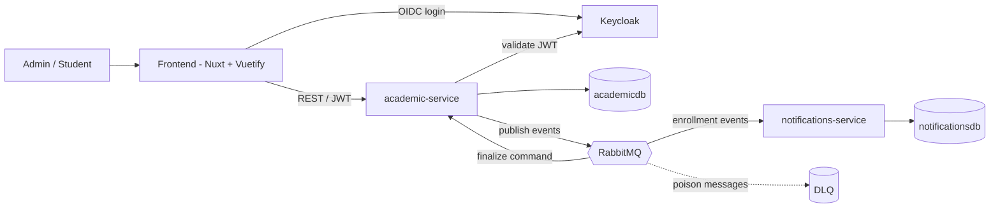
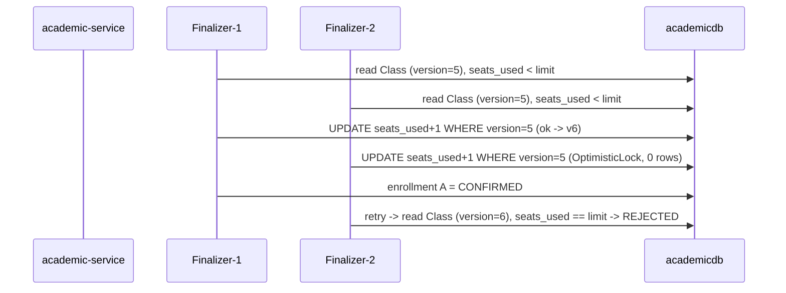

# Technical Design — Academic Enrollment System

## Metadata

- Status: Approved
- Tier: 2
- Mode: AI Architect
- Aggregates: Student, Course, Subject, Class, Enrollment

## Approved Input

- PRD — approved.
- UI Skeleton — approved.

## 1. Scope & Context

Two independent Spring Boot services decoupled by asynchronous events over RabbitMQ, a Nuxt/Vue (Vuetify) frontend, and Keycloak for identity. Business scope lives in the PRD; this document is the "how". Everything runs locally via Docker Compose.

The services map 1:1 to the bounded contexts in the Domain Map: **academic-service = Academic Enrollment**, **notifications-service = Notifications & Audit**; **Keycloak realizes the Identity context**. Aggregate names below come from the Domain Map.



Out of scope (technical): realtime push to the browser (polling instead); multiple database instances (one PostgreSQL, two databases); real cloud deployment.

**Repository layout (monorepo).** Backend and frontend live in **one git repository** — not split into separate products at this stage. A `services/` folder holds the two Spring Boot services and a `web/` folder holds the Nuxt/Vue app, with `docker-compose.yml` and `tanii/` at the root. Splitting into independent repositories is deliberately deferred.

```
academic-enrollment-system/
├── services/           academic-service · notifications-service
├── web/                Nuxt/Vue app
├── docker-compose.yml  infra + app services
└── tanii/              method artifacts (this doc, PRD, domain map, …)
```

## 2. Non-Functional Requirements

| Category | Technical stance |
|---|---|
| Concurrency correctness | Optimistic lock on the `Class` seat counter; proven by a concurrency test. |
| Exactly-once outcome | Idempotent consumers keyed by `eventId`; transactional outbox. |
| Resilience of side effects | Notifications/audit failures never block the core; retry + DLQ. |
| Performance at scale | Paged, filtered queries; indexed lookups by student and class. |
| Auditability | Append-only `audit_log` owned by notifications-service. |
| Security | Keycloak OIDC; role-based; ownership checks. |
| Observability | JSON logs + correlation/trace id across HTTP and the broker; health and metrics via Micrometer/Actuator (in-app — already meets the need). Prometheus/Grafana/Jaeger dashboards optional. Strategic/business metrics (via BI over a read replica) noted as evolution. |

## 3. Dependencies

- Java 21, Spring Boot (Web, Data JPA, Security resource server, AMQP, Actuator, Validation), Flyway, springdoc-openapi, Micrometer/OpenTelemetry.
- PostgreSQL, RabbitMQ, Keycloak.
- Nuxt/Vue + Vuetify.
- Testcontainers; Docker Compose (postgres, rabbitmq, keycloak, academic-service, notifications-service, frontend).

## 4. Backend

### 4.1 Data model

Each service owns its data — no shared tables. One PostgreSQL instance, two databases.

**academic-service (`academicdb`)**

*Student*

| Column | Type | Notes |
|---|---|---|
| `id` | UUID | PK |
| `name` | TEXT | NOT NULL |
| `email` | TEXT | NOT NULL, UNIQUE |
| `document` | TEXT | optional |

*Course*

| Column | Type | Notes |
|---|---|---|
| `id` | UUID | PK |
| `name` | TEXT | NOT NULL |
| `description` | TEXT | optional |

*Subject*

| Column | Type | Notes |
|---|---|---|
| `id` | UUID | PK |
| `name` | TEXT | NOT NULL |
| `course_id` | UUID | FK → course, NOT NULL |
| `description` | TEXT | optional |

*Class*

| Column | Type | Notes |
|---|---|---|
| `id` | UUID | PK |
| `subject_id` | UUID | FK → subject, NOT NULL |
| `label` | TEXT | NOT NULL |
| `seat_limit` | INT | NOT NULL, CHECK > 0 |
| `seats_used` | INT | NOT NULL, DEFAULT 0 |
| `status` | TEXT | NOT NULL — `OPEN` \| `CLOSED` |
| `version` | BIGINT | NOT NULL — optimistic lock |

*Enrollment*

| Column | Type | Notes |
|---|---|---|
| `id` | UUID | PK |
| `student_id` | UUID | FK → student, NOT NULL |
| `class_id` | UUID | FK → class, NOT NULL |
| `status` | TEXT | NOT NULL — `PENDING` \| `PROCESSING` \| `CONFIRMED` \| `REJECTED` \| `CANCELLED` |
| `created_at` | TIMESTAMPTZ | NOT NULL |
| `updated_at` | TIMESTAMPTZ | NOT NULL |

> Partial unique index on `(student_id, class_id)` while status ∈ {PENDING, PROCESSING, CONFIRMED} — one active enrollment per class.

*outbox*

| Column | Type | Notes |
|---|---|---|
| `id` | UUID | PK |
| `aggregate_type` | TEXT | e.g. `Enrollment` |
| `event_type` | TEXT | e.g. `enrollment.confirmed.v1` |
| `payload` | JSONB | event body |
| `created_at` | TIMESTAMPTZ | NOT NULL |
| `published_at` | TIMESTAMPTZ | NULL until published by the relay |

**notifications-service (`notificationsdb`)**

*audit_log* (append-only) — enrollment lifecycle only

| Column | Type | Notes |
|---|---|---|
| `id` | UUID | PK |
| `event_id` | UUID | UNIQUE — idempotency |
| `enrollment_id` | UUID | |
| `student_id` | UUID | |
| `class_id` | UUID | |
| `action` | TEXT | `CREATED` \| `CONFIRMED` \| `REJECTED` \| `CANCELLED` |
| `actor` | TEXT | who did it (from JWT) |
| `occurred_at` | TIMESTAMPTZ | when it happened |
| `received_at` | TIMESTAMPTZ | when audited |
| `payload` | JSONB | event body |

Examples — creation: `action=CREATED, actor=ana@x.com, payload={status:PENDING}`; confirmation: `action=CONFIRMED, actor=ana@x.com, payload={seats_used:30}`.

### 4.2 Endpoints

REST/JSON under `/api`, role in parentheses, lists paged/filtered. Full OpenAPI is emitted at build time (mandatory backend output).

- **Catalog (ADMIN):** CRUD `/api/students`, `/api/courses`, `/api/subjects`, `/api/classes`; `POST /api/classes/{id}/open` · `/close`.
- **Browsing (STUDENT/ADMIN):** `GET /api/classes?subjectId=&status=OPEN` (with seat availability).
- **Enrollment:** `POST /api/enrollments` (create PENDING) · `POST /api/enrollments/{id}/confirm` (202, → PROCESSING) · `POST /api/enrollments/{id}/cancel` · `GET /api/enrollments?studentId=&classId=&status=` (ADMIN all; STUDENT own) · `GET /api/enrollments/{id}`.
- **Operational:** `/actuator/health`, `/actuator/prometheus`, `/v3/api-docs` (+ `/swagger-ui`).
- Access management → Keycloak admin console (not a custom API).

### 4.3 Messaging (events & topology)

Broker: **RabbitMQ** (rationale in ADR-0001). Two patterns:

- **Command — work queue:** `enrollment.finalize.q` (+ `.dlq`). academic-service publishes one finalize command per submitted enrollment; concurrent consumers compete — this competition is what creates the seat race.
- **Events — fanout:** exchange `enrollment.events` broadcasts every domain event to two bound queues, `enrollment.notify.q` and `enrollment.audit.q` (+ `.dlq`), both consumed by notifications-service (notify + append to `audit_log`).

Event envelope: `eventId`, `schemaVersion`, `occurredAt` + payload; versioned type names (`enrollment.confirmed.v1`); **additive-only** evolution (new optional fields; never remove/rename); no schema registry. Reliability: transactional outbox, idempotent consumers (by `eventId`), bounded retry + DLQ.

### 4.4 Business rules & concurrency

Lifecycle: `PENDING` (cart) → `PROCESSING` (accepted) → `CONFIRMED` | `REJECTED`; `CANCELLED` from any active state. A seat is consumed only on entering CONFIRMED and released only on CONFIRMED → CANCELLED; PENDING/PROCESSING hold no seat. Create and confirm require an OPEN class; cancel is always allowed.

**Accept-then-finalize:** confirm returns **202 Accepted**, sets the enrollment to PROCESSING and writes a finalize command to the outbox in one transaction; a concurrent finalizer then secures the seat.

**Seat integrity — optimistic locking:** the finalizer reads the `Class` (with `version`), checks `seats_used < seat_limit`, increments, saves. A concurrent change raises `OptimisticLockException` → **bounded retry** (fresh read); if seats are gone → REJECTED. Concurrent consumers are required — a serial consumer would hide the race. Test: N simultaneous confirmations for the last seat → exactly one CONFIRMED, the rest REJECTED.



### 4.5 Authorization & errors

**What is created in Keycloak.** One realm, one client, and **fine-grained action rules** grouped into two **composite roles**. A user gets one composite role (`ADMIN` or `STUDENT`); the JWT carries the effective action rules in `realm_access.roles`; each endpoint requires the specific rule. Composite roles keep day-to-day assignment simple while the fine-grained rules give precise, per-action control (and room for variants later, e.g. a read-only admin).

**Role `ADMIN`** = these rules (exactly what an admin can do):

`adm_create_student`, `adm_read_student`, `adm_update_student`, `adm_delete_student` · the same four for course, subject, class (`adm_{create,read,update,delete}_{course,subject,class}`) · `adm_open_class`, `adm_close_class` · `adm_create_enrollment`, `adm_confirm_enrollment`, `adm_cancel_enrollment`, `adm_read_enrollment`.

**Role `STUDENT`** = these rules (exactly what a student can do):

`student_browse_class`, `student_create_enrollment`, `student_confirm_enrollment`, `student_cancel_enrollment`, `student_read_enrollment`.

**Endpoint → required rule** (for `student_*` the app also enforces ownership — data-dependent, so it stays in code, not Keycloak):

| Method + Path | Required rule |
|---|---|
| `POST/GET/PUT/DELETE /api/students` | `adm_{create,read,update,delete}_student` |
| `POST/GET/PUT/DELETE /api/courses` | `adm_{create,read,update,delete}_course` |
| `POST/GET/PUT/DELETE /api/subjects` | `adm_{create,read,update,delete}_subject` |
| `POST/GET/PUT/DELETE /api/classes` | `adm_{create,read,update,delete}_class` |
| `POST /api/classes/{id}/open` | `adm_open_class` |
| `POST /api/classes/{id}/close` | `adm_close_class` |
| `GET /api/classes?status=OPEN` | `student_browse_class` (ADMIN via `adm_read_class`) |
| `POST /api/enrollments` | `student_create_enrollment` (self) · `adm_create_enrollment` (any) |
| `POST /api/enrollments/{id}/confirm` | `student_confirm_enrollment` (own) · `adm_confirm_enrollment` |
| `POST /api/enrollments/{id}/cancel` | `student_cancel_enrollment` (own) · `adm_cancel_enrollment` |
| `GET /api/enrollments?studentId=&classId=` | `student_read_enrollment` (own; `studentId` forced to token `sub`) · `adm_read_enrollment` (all) |
| `GET /api/enrollments/{id}` | `student_read_enrollment` (own) · `adm_read_enrollment` |

**Ownership:** for `student_*` enrollment rules, `enrollment.student_id` must equal the token `sub`.

**Errors:** no/invalid token → `401`; missing rule or ownership fails → `403`; business errors (class closed, no seats, duplicate active) → `409`/`422` via the standardized error envelope; input validation → `400`. Events carry only the identifiers needed — no unnecessary personal data.

## 5. Frontend

Detailed in the approved UI Skeleton — admin management + student self-service, Nuxt/Vue + Vuetify. The asynchronous outcome (CONFIRMED/REJECTED) surfaces on "My Enrollments" via short polling while any enrollment is PROCESSING; no realtime push in scope.

## 6. Infrastructure

What runs alongside the code, and **why each** — all self-hosted via Docker Compose for local reproducibility.

| Component | Role | Why this one |
|---|---|---|
| **PostgreSQL** | System of record — two databases (`academicdb`, `notificationsdb`) | Relational integrity fits the domain (FKs, constraints, transactions). The **seat guarantee lives here**: optimistic locking (`version`) and the transactional **outbox** both rely on ACID transactions. Mature and trivial in Compose. |
| **RabbitMQ** | Message broker — finalize work queue + events fanout, with DLQs | Right-sized for command + pub/sub at this volume; native retry/DLQ; competing consumers keep the concurrency demonstration honest. Full rationale (vs Kafka / SNS+SQS) in ADR-0001. |
| **Keycloak** | Identity provider (OIDC) | Standard OIDC/OAuth2 out of the box — realm, client, roles, token issuance — so services stay plain resource servers instead of hand-rolling auth. Realm is imported for reproducibility. |
| **Docker Compose** | Local orchestration of infra + app services | The delivery target is a reproducible **local** run (`docker compose up`), not cloud. Brings everything up together and supports `--scale` for the concurrency demo. |

App services (academic-service, notifications-service, frontend) are the code, provisioned into the same Compose — see below.

## 7. Runtime & Deployment

Local, via Docker Compose: `postgres` (two databases), `rabbitmq`, `keycloak`, `academic-service`, `notifications-service`, `frontend`.

**Reproducing concurrency (local-only concern):** to show the seat race across processes, scale the API — `docker compose up --scale academic-service=2`. This requires the service to be **stateless** (state only in Postgres/RabbitMQ) and to **not bind a fixed host port** when scaled (instances auto-named `academic-service-1/-2`). Both instances' consumers compete on `enrollment.finalize.q`; PostgreSQL (optimistic lock) is the single arbiter. In the cloud an orchestrator handles this — it matters only for local reproduction.

**No load balancer is required for the race:** it happens where the finalization consumers pull from the queue, and RabbitMQ already distributes messages across competing consumers on both instances — the HTTP path may even hit a single instance. A gateway/load balancer (e.g. Traefik, which auto-discovers scaled Compose services) is optional polish for the HTTP path (one stable URL, requests spread) — realistic, not required.

## Architecture Decisions

- **ADR-0001 — RabbitMQ** as broker (not Kafka now; SNS+SQS as the managed equivalent) — see `central/architecture-decisions/0001-messaging-broker-rabbitmq.md`.
- Two independent services integrated only by asynchronous events.
- Optimistic locking (`@Version`) on `Class` + bounded retry for seat integrity.
- Transactional outbox; idempotent consumers; retry + DLQ.
- Per-service databases in one PostgreSQL instance.
- Additive event versioning; no schema registry.
- OpenAPI as a mandatory backend build output.
- Keycloak IdP; roles ADMIN / STUDENT.

## Testing

- Unit: domain rules (seat limit, status transitions, uniqueness, optimistic-retry).
- Integration (Testcontainers: PostgreSQL + RabbitMQ): REST flows, event publish/consume, DLQ.
- Concurrency: the last-seat race test above.

## Risks

- Serial consumer hides the race → configure concurrent listeners and prove with the test.
- Retry storms under heavy contention → bound retries, then REJECTED; keep transactions short.
- Trace propagation across RabbitMQ → verify the correlation id crosses the broker.
